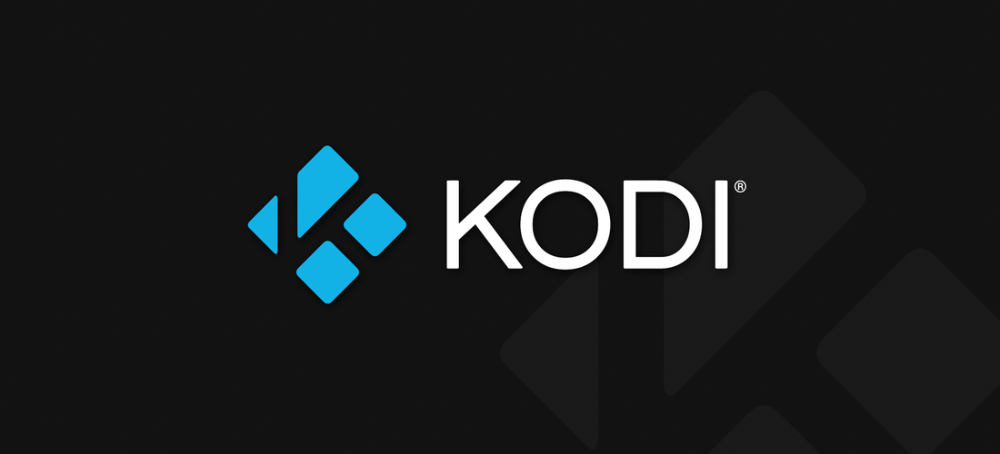

  <strong>
    <a href="https://kodi.tv/">website</a>
    •
    <a href="https://kodi.wiki/view/Main_Page">docs</a>
    •
    <a href="https://forum.kodi.tv/">community</a>
    •
    <a href="https://kodi.tv/addons">add-ons</a>
  </strong>

  
  
  
  
  
  
  

  
  
  
  
  
  
  

<h1 align="center">
  Welcome to Kodi Home Theater Software!
</h1>

# Kodi Home Theater Software

**Welcome to Kodi!**

Kodi is an award-winning free and open source (GPL) software media player and
entertainment hub for digital media. Kodi is available for multiple platforms.
Created in 2003 by a group of like minded programmers, Kodi is a non-profit
project run and developed by volunteers located around the world.
More than 450 software developers have contributed to Kodi to date, and 100-plus
translators have worked to expand its reach, making it available in more
than 70 languages.

While Kodi functions very well as a standard media player application for your
computer, it has been designed to be the perfect companion for your HTPC.
Supporting an almost endless range of remote controls, and combined with its
beautiful interface and powerful skinning engine, Kodi feels very natural to
use from the couch and is the ideal solution for your home theater.

Currently Kodi can be used to play almost all popular audio and video formats
around. It was designed for network playback, so you can stream your multimedia
from anywhere in the house or directly from the internet using practically any
protocol available.

Use your media as-is: Kodi can play CDs and DVDs directly
from the disk or image file, almost all popular archive formats from your hard
drive, and even files inside ZIP and RAR archives. It will even scan all of
your media and automatically create a personalized library complete with box
covers, descriptions, and fanart. There are playlist and slideshow functions, a
weather forecast feature and many audio visualizations. Once installed, your
computer will become a fully functional multimedia jukebox.

## Installation

See [docs/README.xxx](https://github.com/xbmc/xbmc/tree/master/docs) for specific platform build information.

## Quick Kodi development links

* [Contributing](https://github.com/xbmc/xbmc/blob/master/CONTRIBUTING.md)
* [Submitting a patch](http://kodi.wiki/view/HOW-TO_submit_a_patch)
* [Code guidelines](https://codedocs.xyz/xbmc/xbmc/code_guidelines.html)
* [Kodi development](http://kodi.wiki/view/Development)

## Useful links

* [Kodi wiki](http://kodi.wiki/)
* [Kodi bug tracker](http://trac.kodi.tv)
* [Kodi community forums](http://forum.kodi.tv/)
* [Kodi website](http://kodi.tv)

**Enjoy Kodi and help us improve it today. :)**

